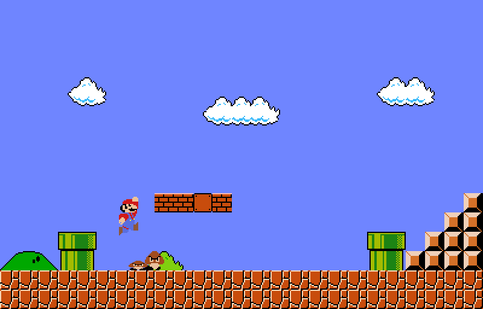

# **Super Mario Bros (1985 version)**
MarioBros_Game is a recreation of the original Super Mario Bros game created in 1985, which is a platform video game developed and published by Nintendo. This recreation was made for my second project of the second term in the 2D and 3D Computer Graphics course with the purpose of understanding and developing computer graphics using drawing algorithms in my own graphics library.
Additionally, this project includes tools also developed with my graphics library, such as a Level Creator and a Sprite Creator, both aimed at making it easier and more faithful to the original to draw each element of the game.

## Game Photos.

## LevelCreator Photos.

## SpriteCreator Photos.

